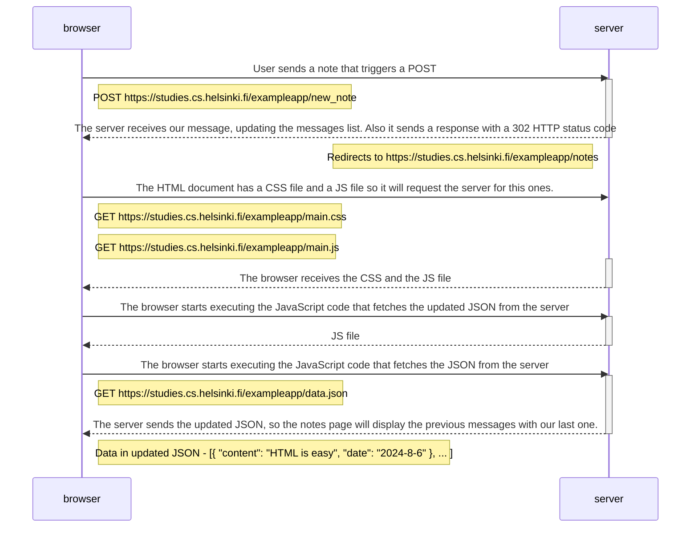

# Process of a user creating a note

```mermaid
sequenceDiagram
    participant browser
    participant server

    browser->>server: User sends a note that triggers a POST
    activate server

    Note right of browser: POST https://studies.cs.helsinki.fi/exampleapp/new_note

    server-->>browser:The server receives our message, updating the messages list. Also it sends a response with a 302 HTTP status code
    deactivate server

    Note left of server: Redirects to https://studies.cs.helsinki.fi/exampleapp/notes

    browser->>server: The HTML document has a CSS file and a JS file so it will request the server for this ones.

    Note right of browser: GET https://studies.cs.helsinki.fi/exampleapp/main.css
    Note right of browser: GET https://studies.cs.helsinki.fi/exampleapp/main.js

    activate server
    server-->>browser: The browser receives the CSS and the JS file
    deactivate server

    browser->>server: The browser starts executing the JavaScript code that fetches the updated JSON from the server
    activate server
    server-->>browser: JS file
    deactivate server

    browser->>server: The browser starts executing the JavaScript code that fetches the JSON from the server
    activate server

    Note right of browser: GET https://studies.cs.helsinki.fi/exampleapp/data.json

    server-->>browser: The server sends the updated JSON, so the notes page will display the previous messages with our last one.
    deactivate server

    Note right of browser:Data in updated JSON - [{ "content": "HTML is easy", "date": "2024-8-6" }, ... ]
```
