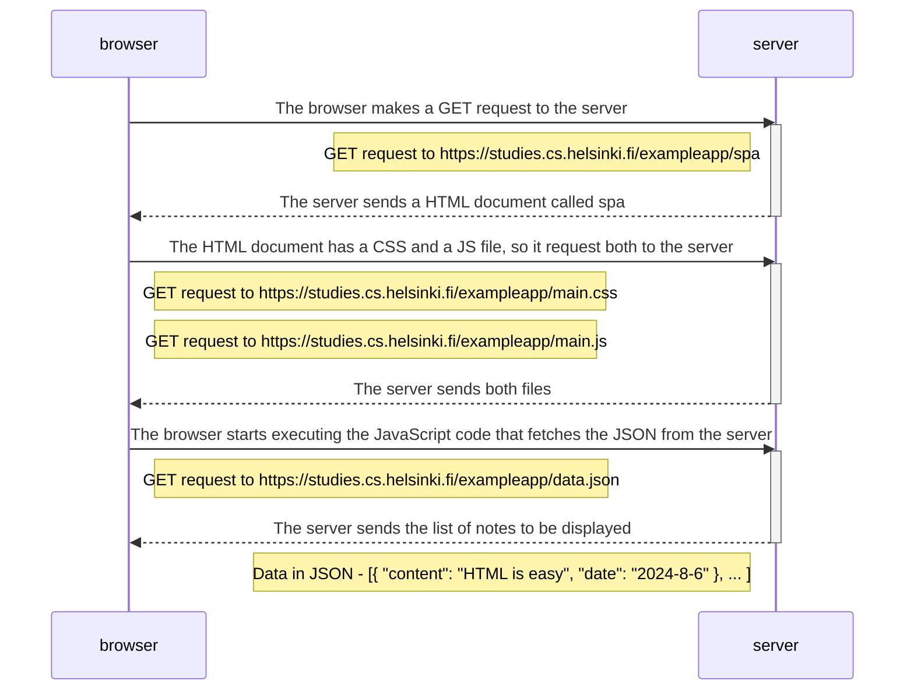

# Process of acceding to the single page application (SPA)

```mermaid
sequenceDiagram
    participant browser
    participant server

    browser->>server: The browser makes a GET request to the server
    activate server

    Note left of server: GET request to https://studies.cs.helsinki.fi/exampleapp/spa

    server-->>browser: The server sends a HTML document called spa
    deactivate server

     browser->>server: The HTML document has a CSS and a JS file, so it request both to the server
    activate server

    Note right of browser: GET request to https://studies.cs.helsinki.fi/exampleapp/main.css
    Note right of browser: GET request to https://studies.cs.helsinki.fi/exampleapp/main.js

    server-->>browser: The server sends both files
    deactivate server

    browser->>server: The browser starts executing the JavaScript code that fetches the JSON from the server
    activate server

    Note right of browser: GET request to https://studies.cs.helsinki.fi/exampleapp/data.json

    server-->>browser: The server sends the list of notes to be displayed
    deactivate server

    Note left of server:Data in JSON - [{ "content": "HTML is easy", "date": "2024-8-6" }, ... ]
```
