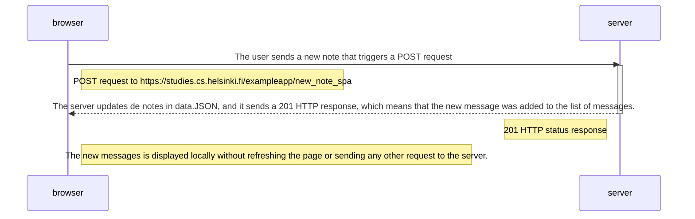

# Process of a user creating a note (SPA)

## Differences between the SPA and the standard page.

- When a new note is uploaded in the SPA, the browser just makes a single request because it doesn't receive a redirect from the server, preventing to make additionals request as the standard page does.
- The only downside is that the new notes are displayed locally, that means if any other user uploads a note at the same time it won't be displayed unless the main user recharges the page.
